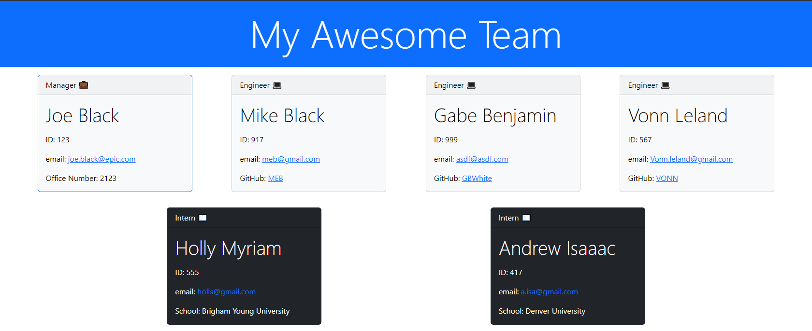

# EZ Team Profile Builder

[](https://opensource.org/licenses/MIT)

## Table of Contents

1. [Description](#description)
    1. [Mock Up](#mock-up)
    2. [Task Completed](#task-completed)
2. [Installation](#installation)
3. [Usage](#usage)
4. [License](#license)
5. [Contributing](#contributing)
6. [Tests](#tests)
7. [User Story and Acceptance Criteria](#user-story-and-acceptance-criteria)
    1. [User Story](#user-story)
    2. [Acceptance Criteria](#acceptance-criteria)
8. [Questions](#questions)

## Description

This project's objective is to build a Node.js command-line application that takes in information about employees on a software engineering team and generates an HTML webpage that displays summaries for each person.

### Mock Up


The demo above produced the mock up below. Click on the image to go directly to the example file:

[](./dist/result.html)

### Task Completed
The task here was to complete a project that would create high-quality files, generated with as little input as possible. Autonomy is essential to become a proficient developer, and saving time generating crisp files would aid in those efforts. This challenge should set myself up for furure success by applying the core skills I've recently learned, meeting certain acceptance criteria with NodeJs. The criteria are documented in the Acceptance Criteria section. 

## Installation

This project utilizes Inquirer version 8.2.4. To install, simply clone or download the repository to your device. It is run using 
```
node index.js
``` 

## Usage

Since this project is not deployed, it is used in the terminal, or command line. It is to be used to generate HTML pages with CSS stylization that displays the profile of a software engineering team. It takes in employees by classes of engineer, intern, and manager (the person running the program). This program is not used to generate more customized pages than what is provided through the program; there are no customization options for style, colors, cards, flex, etc. It could be customized after the program is run, but not before or during. 

## License

[](https://opensource.org/licenses/MIT)

This project is licensed under the MIT license.

## Contributing

To contribute to this repository, simply create a pull request, create issues, or reach out to me (see [Questions](#questions) below). I do my best to ensure that pull requests are up to date. 

## Tests

This application uses Jest for running unit tests and Inquirer for collecting input from the user (which can also be used for testing by invoking the application with the command 'node index.js'). It uses unit test cases to render tests on each of the classes in the project and evaluates expectation for property values and methods. The test will fail if the actual functionality does not match the expected output: either the change is unexpected, or the reference  needs to be updated. After JEst is installed, the unit tests can be run with
```
npm run test
```

## User Story and Acceptance Criteria

### User Story
```
AS A manager
I WANT to generate a webpage that displays my team's basic info
SO THAT I have quick access to their emails and GitHub profiles
```

### Acceptance Criteria
```
GIVEN a command-line application that accepts user input
WHEN I am prompted for my team members and their information
THEN an HTML file is generated that displays a nicely formatted team roster based on user input
WHEN I click on an email address in the HTML
THEN my default email program opens and populates the TO field of the email with the address
WHEN I click on the GitHub username
THEN that GitHub profile opens in a new tab
WHEN I start the application
THEN I am prompted to enter the team manager’s name, employee ID, email address, and office number
WHEN I enter the team manager’s name, employee ID, email address, and office number
THEN I am presented with a menu with the option to add an engineer or an intern or to finish building my team
WHEN I select the engineer option
THEN I am prompted to enter the engineer’s name, ID, email, and GitHub username, and I am taken back to the menu
WHEN I select the intern option
THEN I am prompted to enter the intern’s name, ID, email, and school, and I am taken back to the menu
WHEN I decide to finish building my team
THEN I exit the application, and the HTML is generated
```

## Questions

If you have any questions, reach out to me through either of the methods below:
- [GitHub - J03B](https://github.com/J03B/)
- [email - (byucrazyfan@gmail.com)](mailto:byucrazyfan@gmail.com)
